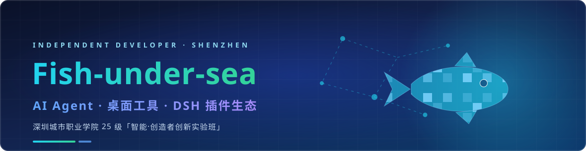

  <em>把「AI 能替我做什么」变成「我已经做出来了什么」。</em>

  
  
  

---

## 🙋 关于我

深圳城市职业学院 25 级「智能·创造者创新实验班」在读。习惯用项目驱动学习：先立一个真实需求，再把技术栈一层层补上。

目前主要在做三件事：

- **AI Agent** —— 把大模型接进真实工作流，而不是停在对话框里（记忆转码、对话式助手、情感分析这类「AI 要落地」的题目）。
- **桌面工具** —— 面向不懂命令行的普通用户，把复杂流程收进一个可视化应用。
- **DSH 插件生态** —— 给自己每天用的工具写插件，攒成一套可复用、可分发的插件集合。

## 🧰 技术栈

<table>
<tr><td><b>语言</b></td><td>

`Python` · `TypeScript` · `JavaScript` · `HTML` · `C++（嵌入式）`

</td></tr>
<tr><td><b>前端 / 桌面</b></td><td>

`React 18` · `Electron` · `Vite` · `Tailwind CSS` · `Flutter`

</td></tr>
<tr><td><b>后端 / AI</b></td><td>

`FastAPI` · `Flask` · `BERT 微调` · `TensorFlow` · `OpenAI 兼容网关` · `Ollama 本地推理`

</td></tr>
<tr><td><b>硬件 / 嵌入式</b></td><td>

`树莓派` · `ESP32-S3-EYE` · `PlatformIO` · `传感器采集与视觉`

</td></tr>
<tr><td><b>工程化</b></td><td>

`Git` · `pnpm workspace` · `Docker Compose` · `MinIO` · `PostgreSQL` · `Vitest`

</td></tr>
</table>

## ⭐ 精选项目

| 项目 | 一句话 | 语言 | Star |
|------|--------|------|:----:|
| **[WinTunerPro](https://github.com/Fish-under-sea/WinTunerPro)** | 面向游戏陪玩从业者与小型工作室的 Windows 桌面优化工具，把「重装 + 优化 + 美化」全流程收进一个傻瓜式应用 | TypeScript · Electron | 3 |
| **[KouriChat](https://github.com/Fish-under-sea/KouriChat)** | 基于原版 KouriChat 的改版，补齐新版 `wxautox4` 依赖，让微信 AI 陪伴助手更容易跑起来 | Python | 4 |
| **[MnemoTranscode](https://github.com/Fish-under-sea/MnemoTranscode)** | 「生物硬盘 → 数字硬盘」的记忆转码工程：把聊天记录提取、结构化、再喂给大模型 | Python · React · FastAPI | 2 |
| **[Cursor-IDE-zh-hans](https://github.com/Fish-under-sea/Cursor-IDE-zh-hans)** | 基于 Microsoft `vscode-loc` 社区项目做的 Cursor 全适配汉化语言包 | Python | 3 |
| **[AgriSense](https://github.com/Fish-under-sea/AgriSense)** | 基于树莓派的 AI 智能大棚监测系统：多传感器 + 计算机视觉，做作物全周期管理 | HTML · Python | 1 |
| **[dsh-fish](https://github.com/Fish-under-sea/dsh-fish)** | 自建 DSH（DeepSeek Harness）插件聚合包，一个包装齐全部自用插件 | JavaScript | 0 |

## 📊 项目状态总览

状态口径：以 2026-09-30 为基准，**🟢 活跃**＝近 2 个月内有提交，**⏸️ 暂停维护**＝2–6 个月未提交，**🗄️ 已完成**＝超过 6 个月未提交（课程作业类，代码保留作参考）。

| 项目 | 状态 | 语言 | 最近提交 | 说明 |
|------|:----:|------|---------|------|
| [dsh-fish](https://github.com/Fish-under-sea/dsh-fish) | 🟢 活跃 | JavaScript | 2026-09-29 | DSH 插件聚合包，仍在持续加插件 |
| [ego-link-ux-prototype](https://github.com/Fish-under-sea/ego-link-ux-prototype) | 🟢 活跃 | JavaScript | 2026-09-28 | AI 交互原型课程工程，按周增量提交 |
| [WinTunerPro](https://github.com/Fish-under-sea/WinTunerPro) | ⏸️ 暂停维护 | TypeScript | 2026-06-24 | 功能已到 v0.2.2，等待实际用户反馈再排下一轮 |
| [MnemoTranscode](https://github.com/Fish-under-sea/MnemoTranscode) | ⏸️ 暂停维护 | Python | 2026-05-21 | 技能节参赛作品，赛事结束后冻结迭代 |
| [skill-festival-submissions](https://github.com/Fish-under-sea/skill-festival-submissions) | ⏸️ 暂停维护 | TypeScript | 2026-05-14 | 上游作品收集仓库的 fork，仅作留档 |
| [25IFIEC](https://github.com/Fish-under-sea/25IFIEC) | ⏸️ 暂停维护 | — | 2026-04-30 | 班级信息仓库，名单更新后才动 |
| [AgriSense](https://github.com/Fish-under-sea/AgriSense) | ⏸️ 暂停维护 | HTML | 2026-04-22 | 课程项目完成，等硬件条件具备再继续 |
| [Cursor-IDE-zh-hans](https://github.com/Fish-under-sea/Cursor-IDE-zh-hans) | ⏸️ 暂停维护 | Python | 2026-04-14 | 等待上游 `vscode-loc` 词条更新后跟进 |
| [cursor-ai-monitor](https://github.com/Fish-under-sea/cursor-ai-monitor) | ⏸️ 暂停维护 | TypeScript | 2026-04-13 | VS Code 扩展原型，验证完想法即告一段落 |
| [live2d-widget](https://github.com/Fish-under-sea/live2d-widget) | ⏸️ 暂停维护 | JavaScript | 2026-04-13 | 上游 `stevenjoezhang/live2d-widget` 的副本，跟随上游 |
| [KouriChat](https://github.com/Fish-under-sea/KouriChat) | ⏸️ 暂停维护 | Python | 2026-03-25 | 改版完成后趋向稳定，`wxautox4` 上游大版本更新再跟 |
| [Campus-Text-Sentiment-Classification-System](https://github.com/Fish-under-sea/Campus-Text-Sentiment-Classification-System) | 🗄️ 已完成 | Python | 2025-12-24 | 课程期末作业（2025 年秋季学期），已结课 |
| [Movie-Review-Sentiment-Analysis-System](https://github.com/Fish-under-sea/Movie-Review-Sentiment-Analysis-System) | 🗄️ 已完成 | Python | 2025-12-24 | 课程期末作业（2025 年秋季学期），已结课 |

> 状态会随提交变化；表格由人工维护，最近一次核对：2026-09-30。

## 📮 联系我

- **邮箱**：1661715118@qq.com
- **Issue**：任何仓库都欢迎直接开 Issue，我会看（暂停维护的项目也看，只是不一定改）。
- **PR**：欢迎，尤其欢迎 DSH 插件与桌面工具方向的补丁。

本主页 Banner 为仓库内自托管 SVG（`assets/banner.svg`），不依赖外部图床，明暗两种主题下均可读。徽章使用 shields.io 静态徽章；若徽章未加载，页面内容与链接不受影响。